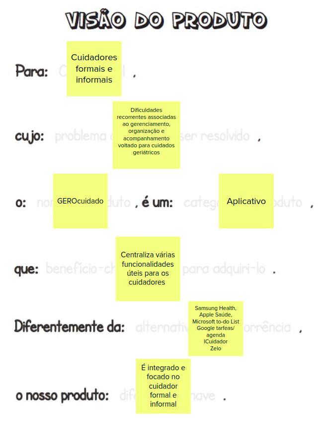
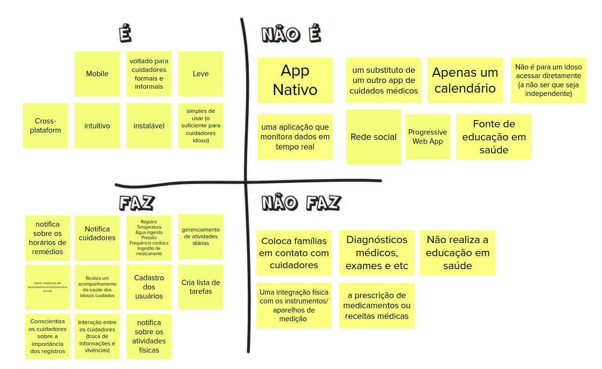
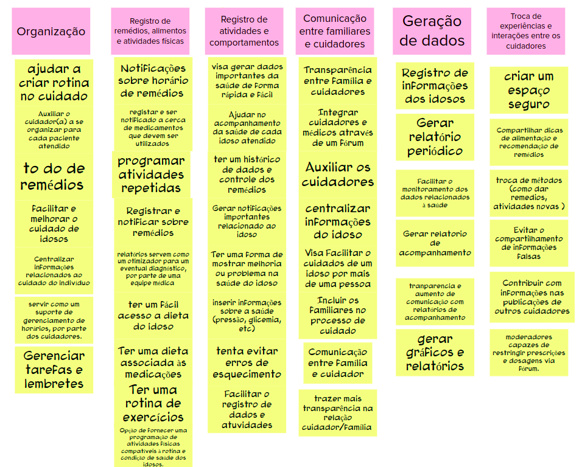

# Lean Inception - Dia 1

## Sobre

No primeiro dia da Lean Inception, são realizadas três atividades cruciais para promover uma compreensão compartilhada e alinhada entre a equipe técnica e o cliente em relação ao produto em desenvolvimento. O objetivo principal dessas etapas é garantir que todos tenham uma visão clara e concisa do que o produto representa e quais são suas funcionalidades essenciais. Este alinhamento é fundamental para que a equipe técnica compreenda plenamente a essência do produto e suas metas, garantindo que estas estejam em sintonia com as expectativas e necessidades do cliente.

## Visão do Produto

A etapa de "Visão do Produto" em uma Lean Inception é uma atividade fundamental que visa estabelecer uma compreensão compartilhada e clara sobre o que é o produto que está sendo desenvolvido. Nesta etapa, a equipe de projeto, incluindo membros técnicos, especialistas em negócios e representantes do cliente ou dos usuários finais, se reúne para criar uma visão geral do produto que está sendo concebido.

A criação da visão do produto é um passo essencial para alinhar a equipe em relação aos objetivos e à essência do projeto. Ela fornece uma referência clara para todos os envolvidos, permitindo que todos compartilhem a mesma mentalidade e entendimento sobre o que estão construindo. Isso é especialmente importante em projetos ágeis, onde a adaptação contínua é valorizada, pois a visão do produto serve como um guia ao longo do desenvolvimento para garantir que o produto permaneça alinhado com os objetivos do cliente e do negócio.

### Visão do Produto do GEROcuidado

## É/não é - Faz/não faz

A etapa de "É/Não É" e "Faz/Não Faz" é uma atividade que envolve a criação de listas que estabelecem o que o produto é e o que ele não é, bem como o que ele faz e o que não faz. Essas listas ajudam a delimitar o escopo do projeto e a evitar mal-entendidos entre a equipe técnica e o cliente.

Aqui está uma explicação mais detalhada dessas duas listas:

* **É/Não É:**

"É" refere-se às características, funcionalidades e elementos que definitivamente fazem parte do produto.
"Não É" refere-se às características, funcionalidades e elementos que definitivamente não fazem parte do produto.
A lista "É/Não É" ajuda a evitar escopo inchado, garantindo que a equipe tenha uma visão clara do que deve ser incluído no produto e do que deve ser excluído.

* **Faz/Não Faz:**

"Faz" refere-se às ações, funcionalidades ou comportamentos específicos que o produto deve executar com sucesso.
"Não Faz" refere-se às ações, funcionalidades ou comportamentos que o produto não deve executar ou que não fazem parte de suas responsabilidades.
A lista "Faz/Não Faz" estabelece expectativas claras sobre o comportamento do produto, ajudando a evitar desentendimentos sobre sua funcionalidade.

### É/não é - Faz/não faz do GEROcuidado

## Objetivos do Produto

A etapa de "Objetivos do Produto" em uma Lean Inception é uma atividade crítica que visa estabelecer de forma clara e mensurável quais são os objetivos que o produto deve alcançar. Esses objetivos são essenciais para direcionar o desenvolvimento do produto e garantir que ele atenda às expectativas do cliente e aos requisitos do negócio.

A partir da ideação dos vários objetivos definidos, tem-se os "clusters" que visam agrupar esses diversos objetivos em colunas que os generalizem.

### Objetivos do Produto do GEROcuidado

