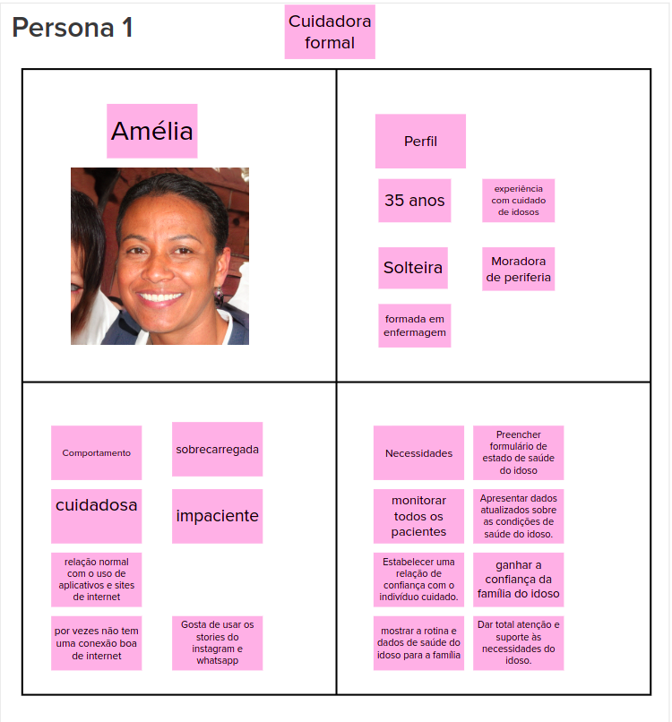
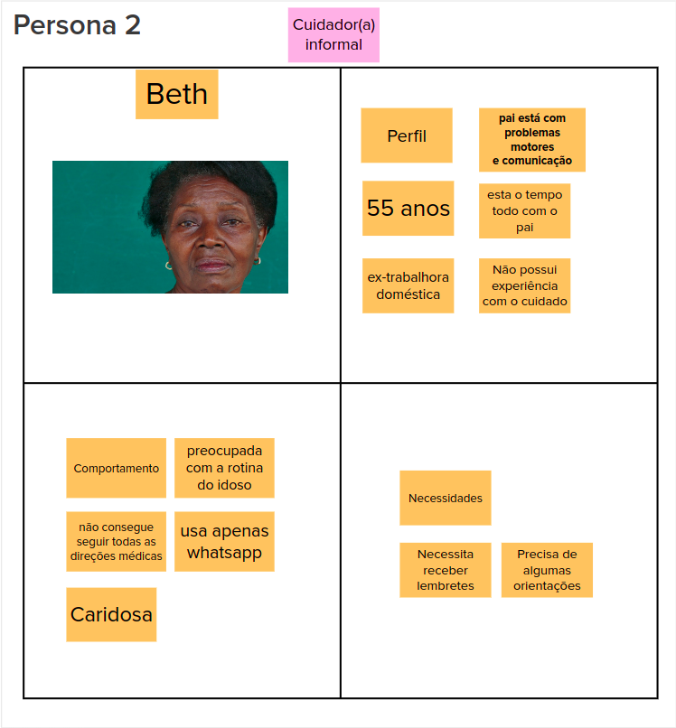
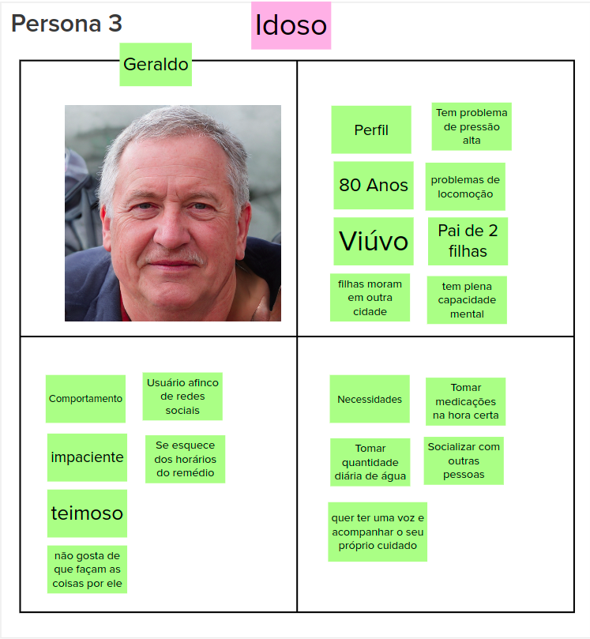
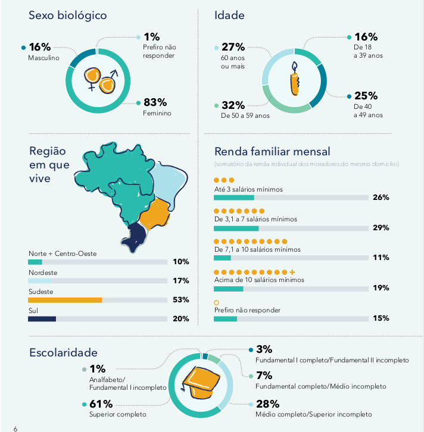
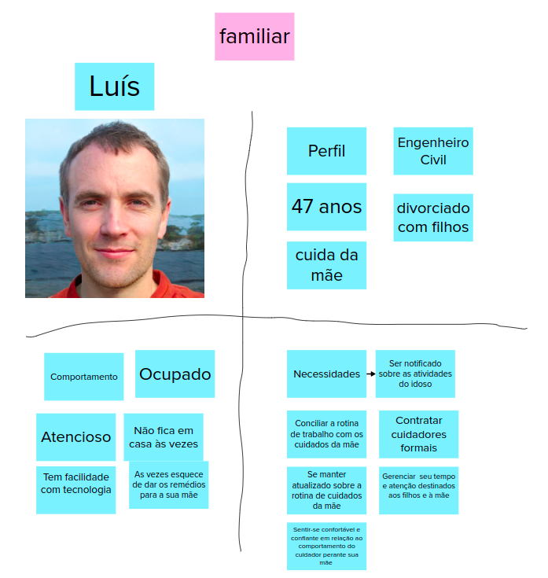
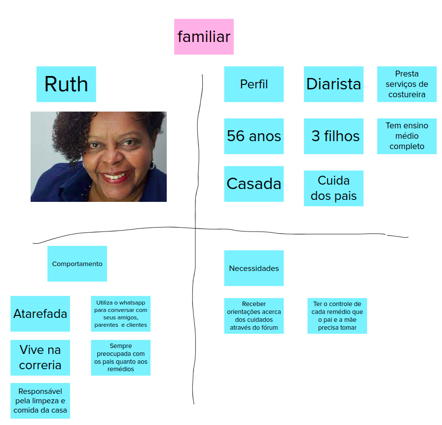
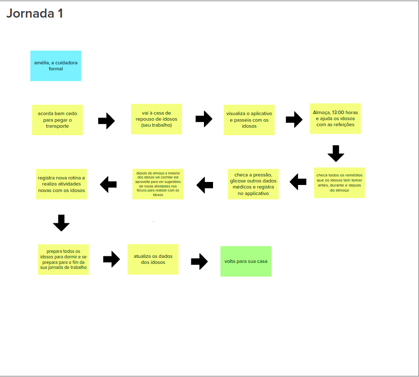
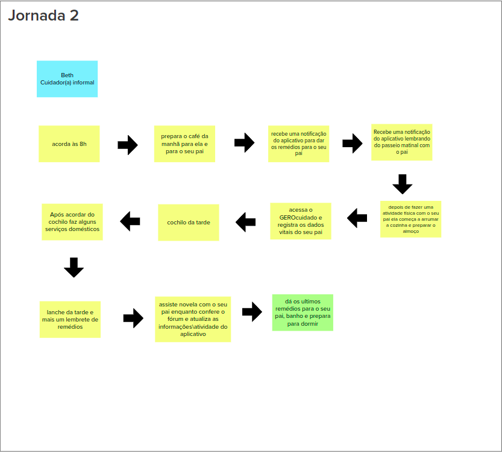
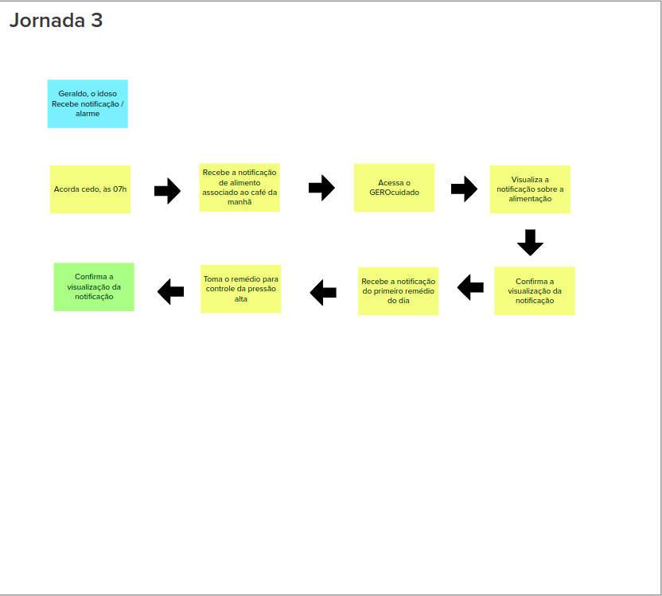

# Lean Inception - Dia 2

## Sobre

O segundo dia da Lean Inception é uma etapa importante no processo de definição e planejamento ágil de um projeto ou produto. Durante o Dia 2, a equipe se concentra em duas atividades-chave: a "Descrição das Personas" e a "Jornada de Usuário". Essas atividades visam criar uma compreensão mais profunda dos usuários e de como eles interagem com o produto.

## Descrição das Personas

Nesta etapa, a equipe começa a criar descrições detalhadas das personas que representam os diferentes tipos de usuários do produto. As personas são representações fictícias de grupos demográficos ou perfis de usuários reais que podem interagir com o produto. Cada persona recebe um nome, uma foto e uma descrição que inclui informações como idade, gênero, necessidades, desafios, metas e comportamentos típicos. O objetivo é humanizar e tornar concretas as diferentes audiências do produto, para que a equipe possa entender melhor suas necessidades e expectativas.

### Personas do GEROcuidado

#### Persona 1 - Cuidadora Formal

#### Persona 2 - Cuidadora Informal

#### Persona 3 - Idoso (independente)

#### Persona 4 - Familiar

Essa parte da descrição de uma persona da parte familiar, foi corrigida, isso se deve ao fato, de ter sido abordado o ponto de ser uma persona que não se encaixe com os perfis identificados na pesquisa mostrada a seguir, onde nela é abordado os perfis dos familiares que geralmente assumem a responsabilidade de cuidadores.

[Pesquisa Cuidadores](../assets/pesquisa-cuidadores_digital.pdf)

Nessa pesquisa é trazido que o perfil de um familiar é:

Considerando essa pesquisa, e tendo sido trazido essas questões pelos membros do Enactus, foi decidido a criação de uma nova persona do ambito familiar, porém a persona criada será mantida, pois pode abordar um outro perfil.

#### Persona 4.1

#### Persona 4.2

## Jornadas de Usuário

A Jornada de Usuário envolve o mapeamento das etapas que uma persona percorre ao interagir com o produto, desde a primeira interação até a conclusão de suas tarefas ou objetivos. Isso ajuda a equipe a identificar os pontos de contato do usuário com o produto, suas emoções, necessidades e potenciais pontos problemáticos ao longo dessa jornada. O mapeamento da jornada do usuário ajuda a equipe a ter uma visão completa da experiência do usuário e a identificar oportunidades de melhoria.

### Jornadas de Usuário do GEROcuidado

#### Jornada de Usuário 1

#### Jornada de Usuário 2

#### Jornada de Usuário 3

