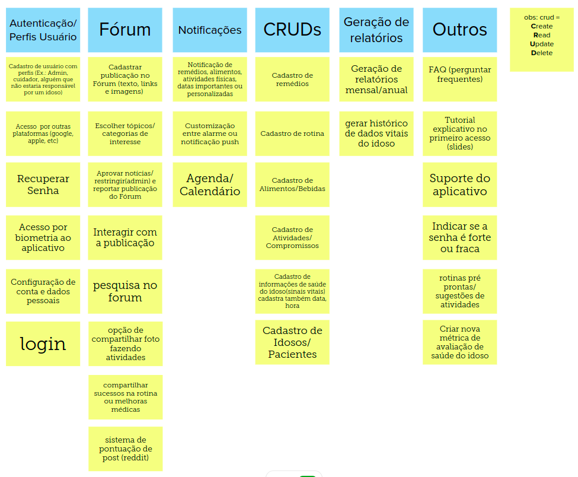
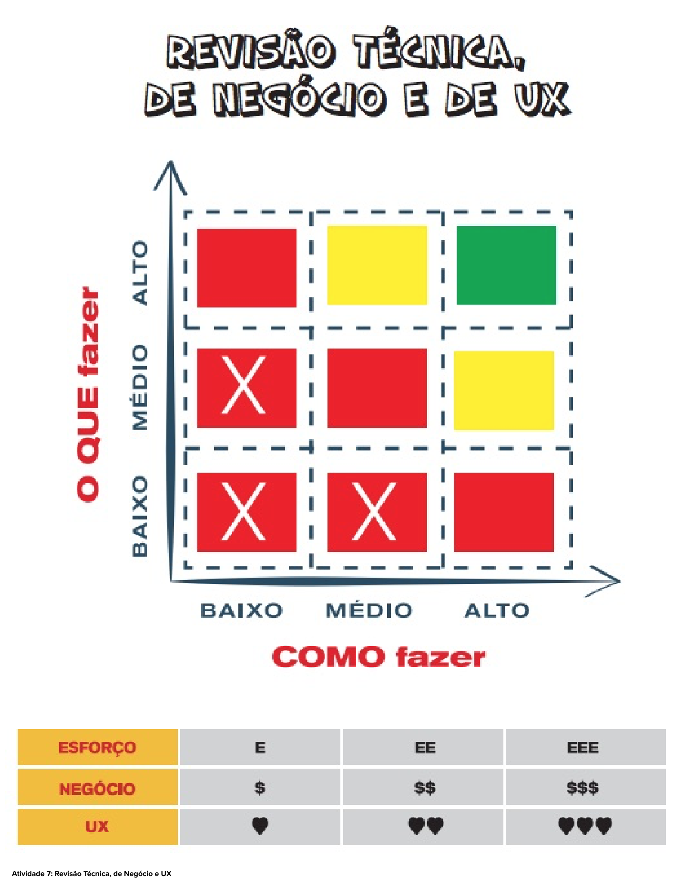

# Lean Inception - Dia 2

## Sobre

O terceiro dia de uma Lean Inception é uma etapa crítica do processo, pois envolve atividades fundamentais para o desenvolvimento do produto. Neste dia, as equipes se concentram em duas tarefas principais: o Brainstorm de Funcionalidade e a Revisão Técnica, de Negócio e de UX.

No final dele, a equipe deve ter uma lista refinada de funcionalidades priorizadas e bem fundamentadas para o produto. Isso ajuda a garantir que o desenvolvimento se concentre nas áreas mais importantes e que todos na equipe tenham uma compreensão compartilhada das metas do projeto.

## *Brainstorm* de Funcionalidades
O brainstorm de funcionalidades é uma atividade colaborativa em que as equipes geram ideias e conceitos para as funcionalidades do produto. O objetivo é criar um conjunto inicial de ideias que possam ser posteriormente avaliadas e priorizadas.

### *Brainstorm* do GEROcuidado

## Revisão técnica, de negócio e UX
Para estabelecer prioridades em relação às funcionalidades, utilizamos diversas ferramentas, sendo uma delas o "Gráfico de Semáforo". Essa representação visual utiliza cores para indicar o nível de confiança da equipe de desenvolvimento na compreensão e capacidade de implementação de cada funcionalidade. O gráfico utiliza três níveis de confiança:

* **Alto (Verde):** Isso significa que a funcionalidade é compreensível e a equipe sabe como implementá-la.

* **Médio (Amarelo):** Indica que há alguma incerteza na compreensão ou na capacidade de implementação da funcionalidade. Pode ser que a equipe compreenda, mas não saiba como executar, ou vice-versa.

* **Baixo (Vermelho):** Esse nível de confiança sugere que a funcionalidade não foi bem compreendida pela equipe e não sabem como implementá-la.

A imagem anexa ilustra a atribuição das cores, mas o ponto crucial é entender que as cores verdes representam um alto nível de confiança, enquanto o vermelho indica um nível de confiança mais baixo.

Além disso, outra ferramenta importante relacionada à priorização de funcionalidades envolve três símbolos:

* **E (Esforço):** Este símbolo demonstra o esforço que a equipe de desenvolvimento precisará dedicar para implementar a funcionalidade.

* **$ (Valor):** Representa o valor que a funcionalidade agrega ao cliente, Product Owner (PO) ou stakeholders, neste caso, o Enactus. É importante notar que todas as funcionalidades têm importância, mas é crucial estabelecer prioridades com base no valor que cada uma delas oferece.

* **<3 (UX - Experiência do Usuário):** Esse símbolo está relacionado ao conceito de User Experience (Experiência do Usuário) e indica o quanto a funcionalidade é interessante para o usuário.

Ao combinar o Gráfico de Semáforo com esses símbolos, a equipe pode ter uma visão mais clara e completa das funcionalidades do projeto, ajudando na tomada de decisões informadas sobre o que implementar primeiro, considerando tanto a compreensão técnica quanto o valor para o usuário e para o negócio.