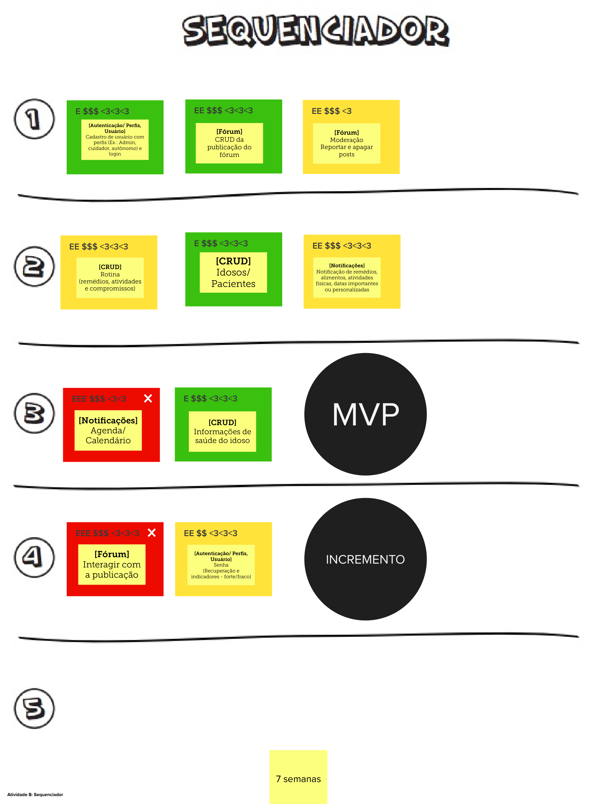
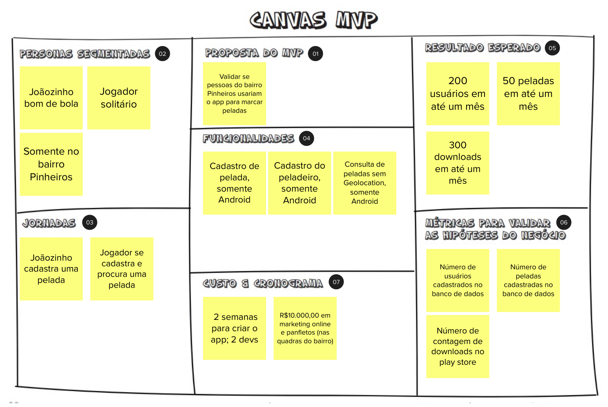

# Lean Inception - Dia 4

## Sobre
O quarto dia de uma Lean Inception é um marco importante no processo de desenvolvimento de um novo projeto ou produto. Neste estágio, as ideias e conceitos começam a se materializar de forma mais concreta. Dois elementos-chave desse dia são o Sequenciador e o Canvas MVP, que desempenham um papel fundamental na definição do escopo e na estruturação do projeto.

## Sequenciador

O Sequenciador é uma atividade na qual a equipe começa a criar uma ordem de prioridade para os recursos e funcionalidades do produto ou projeto. Neste ponto, as ideias geradas nos dias anteriores são discutidas e organizadas em uma sequência lógica. Isso envolve identificar quais funcionalidades são essenciais para o MVP (Produto Mínimo Viável) e quais podem ser adiadas para versões futuras. O objetivo é criar uma lista de tarefas priorizadas que guiarão o desenvolvimento do produto.

É importante ressaltar também, que essa etapa realizada com os quadros das funcionalidades priorizadas na etapa de revisão técnica devem ser alocados em "ondas", essas ondas indetificam a ordem do que será realizado, por conta disso existem algumas regras, que garantem o valor por parte do cliente e do usuário ao mesmo tempo, em que são definidas ondas que não tenham um esforço muito grande para ser completada, as regras são as seguintes:

* **Regra 1:** Uma onda pode conter no máximo três, cartões.

* **Regra 2:**  Uma onda não pode conter mais de uma cartão vermelho.

* **Regra 3:**  Uma onda não pode conter três cartões somente amarelos ou vermelho.

* **Regra 4:**  A soma de esforço dos cartões não pode ultrapassar cinco Es.

* **Regra 5:** A soma de valor dos cartões não pode ser menos de quatro $s e quatro corações.

* **Regra 6:** Se um cartão depende de outro, esse outro deve estar em alguma onda anterior.

### Sequenciador do GEROcuidado

## Canvas MVP

O Canvas MVP é uma ferramenta visual que ajuda a equipe a definir o que fará parte do Produto Mínimo Viável. Ele geralmente é composto por nove áreas ou blocos, incluindo:

**a. Objetivo do MVP:** Uma declaração clara do que se pretende alcançar com o MVP.

**b. Problema:** Uma descrição do problema que o MVP está resolvendo para os usuários.

**c. Solução:** Uma visão geral da solução que será implementada.

**d. Usuários:** Quem são os usuários-alvo do MVP.

**e. Características Principais:** As funcionalidades centrais que serão incluídas no MVP.

**f. Métricas de Sucesso:** Como o sucesso do MVP será medido.

**g. Hipóteses:** Suposições ou previsões que estão sendo testadas com o MVP.

**h. Restrições:** Quaisquer limitações ou restrições que afetam o desenvolvimento do MVP.

**i. Aprendizados:** Espaço para registrar o que a equipe aprendeu durante o processo de criação do Canvas MVP.

O Canvas MVP ajuda a equipe a visualizar de forma clara e concisa o escopo do Produto Mínimo Viável, garantindo que todos tenham uma compreensão comum do que será desenvolvido e por quê.

### Canvas MVP do GEROcuidado

