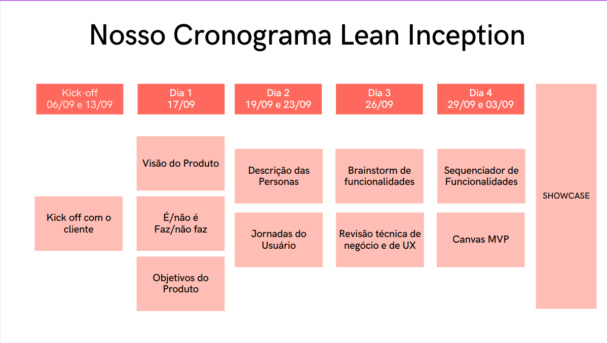

# Kick-off

## Sobre

O Kickoff é uma reunião crucial que reúne todas as partes interessadas, incluindo membros da equipe de desenvolvimento, stakeholders do projeto, especialistas técnicos e, idealmente, o cliente ou representantes dos usuários finais. Durante essa reunião, várias atividades são realizadas:

* **Apresentação do Objetivo:** O facilitador do Lean Inception, que é geralmente um especialista experiente na metodologia, apresenta o objetivo geral da Lean Inception e define as expectativas para a semana de trabalho. Ele esclarece que o objetivo é definir e planejar o Minimum Viable Product (MVP) de forma colaborativa e eficiente.

* **Explicação do Processo:** O facilitador explica o processo que será seguido ao longo da semana, destacando as atividades-chave que serão realizadas em cada dia. Isso ajuda a equipe a entender a sequência das atividades e a importância de cada uma delas.

* **Definição dos Participantes:** São apresentados os membros da equipe e os participantes, garantindo que todos saibam quem está envolvido e qual é o seu papel.

* **Contextualização do Projeto ou Produto:** A equipe compartilha informações essenciais sobre o projeto ou produto em questão. Isso inclui detalhes sobre o mercado, o público-alvo, os objetivos e os desafios.

* **Esclarecimento de Dúvidas:** É fornecida a oportunidade para os participantes fazerem perguntas e esclarecerem quaisquer dúvidas sobre o processo ou o projeto.

* **Definição do cronograma:** Geralmente também é estabelecido um cronograma referente às etapa do Lean Inception, ele serve para ilustrar quais etapas serão realizadas em quais dias, e em quais momentos do dia.

* **Definição dos Resultados Esperados:** Por fim, são estabelecidos os resultados esperados ao final da semana, como uma visão clara do produto, personas definidas, funcionalidades priorizadas e um roadmap inicial.

O Kickoff desempenha um papel fundamental ao alinhar todos os participantes em relação aos objetivos e ao processo da Lean Inception. Ele cria um ambiente de colaboração e entusiasmo, motivando a equipe a trabalhar juntos de forma eficiente ao longo da semana para alcançar os resultados desejados. É o ponto de partida para uma jornada produtiva de definição e planejamento ágil do MVP.

## Cronograma

