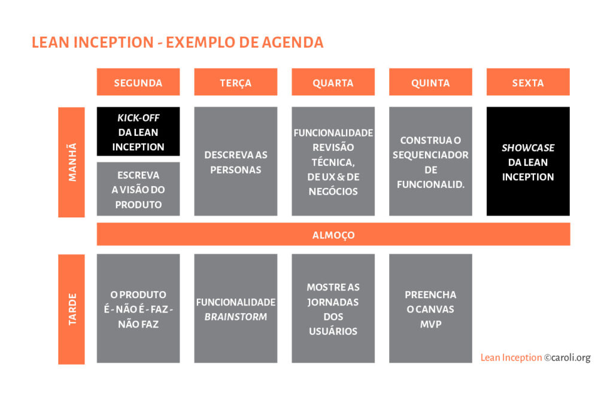

# Lean Inception

## Sobre

A metodologia Lean Inception, concebida por Paulo Caroli, é uma abordagem inovadora que visa alcançar o Minimum Viable Product (MVP), ou Produto Mínimo Viável, de forma colaborativa e eficiente. O próprio nome, "Lean Inception", sugere sua natureza enxuta e ágil, refletindo uma fase inicial em que as partes de negócios e técnicas se unem em um curto período de tempo. Esse período costuma ser limitado a uma semana, idealmente com uma carga horária de 40 horas semanais dedicadas ao processo. Um dos pilares fundamentais desta metodologia é a constante participação do cliente, o que a torna verdadeiramente colaborativa.

## Atividades do Lean Inception

O funcionamento do Lean Inception é baseado em uma série de atividades estruturadas que são conduzidas ao longo da semana. Cada atividade desempenha um papel específico no processo de definição e refinamento do MVP. Vamos explorar algumas dessas atividades-chave:

* **Kickoff:** A semana Lean Inception começa com uma reunião de início, onde os participantes são introduzidos ao processo e ao objetivo. Isso estabelece o tom e a direção para o trabalho colaborativo que se seguirá, assim como o cronograma das atividades a serem desenvolvidas.

* **Dia 1:** Visão do Produto, É/Não é, Faz/Não faz e Objetivos do Produto: No primeiro dia, o foco está na definição da visão do produto, bem como na criação de listas de elementos "É/Não é" e "Faz/Não faz". Além disso, são estabelecidos os objetivos claros do produto a serem alcançados. No geral o Dia 1 tem como foco o alinhamento da visão sobre o produto da equipe de desenvolvimento e do cliente, para que fique claro qual o produto que se deseja criar.

* **Dia 2:** Descrição das Personas e Jornada de Usuário: O segundo dia concentra-se na criação detalhada das personas, representando os principais usuários do produto, e na mapeação de suas jornadas. Isso ajuda a direcionar o desenvolvimento para atender às necessidades específicas dos usuários.

* **Dia 3:** Brainstorm de Funcionalidades e Revisão Técnica, de Negócio e UX: No terceiro dia, ocorre uma intensa sessão de brainstorming para gerar ideias de funcionalidades. Simultaneamente, são realizadas a etapa de gráfico de semáforo e a revisão técnica, de negócio e ux para estabelecer uma priorização sobre as funcionalidades levantas. Dessa forma são estabelecidas e priorizadas as funcionalidades que irão compor o MVP.

* **Dia 4:** Sequenciador de Funcionalidades e Canvas MVP: Durante o quarto dia, as funcionalidades geradas são priorizadas e organizadas em um sequenciador, esse sequenciador possui algumas regras, essas regras separam as funcionalidades em ondas, indicando o tempo, e nela também são definidos as funcionalidades que irão compor o MVP e o quais seriam incrementos. Além disso, o Canvas MVP é preenchido, delineando o escopo do Produto Mínimo Viável.

* **Showcase:** A semana Lean Inception é concluída com uma apresentação (showcase) das decisões tomadas, incluindo a visão do produto, as personas, as funcionalidades prioritárias e o roadmap para o desenvolvimento do MVP. Isso assegura que todos os envolvidos estejam alinhados e tenham uma compreensão clara do caminho a seguir.

O Lean Inception se destaca por sua abordagem ágil e colaborativa, permitindo que as equipes trabalhem juntas de forma eficiente para definir, priorizar e desenvolver o MVP em um curto espaço de tempo. Essa metodologia ajuda a reduzir o desperdício de recursos e acelerar o tempo de entrega, garantindo que o produto final atenda às necessidades reais dos clientes.

## Exemplo de cronograma do Lean Inception

