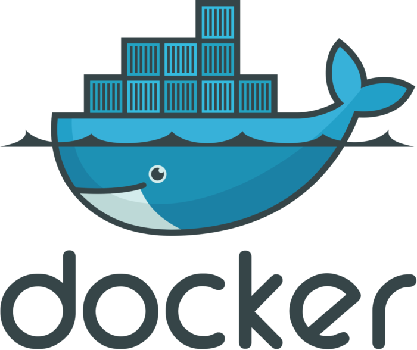

# Documentação das Ferramentas
Este documento tem como objetivo explicar as tecnologias que serão usadas no projeto GEROcuidado.


## React Native 

 - O React Native é um framework desenvolvido pelo Facebook que utiliza de JavaScript e a biblioteca React para desenvolvimento de aplicativos para IOS e Android. Sendo essa sua principal vantagem, executar o mesmo código em diversas plataformas diferentes. Em vez de renderizar elementos na Web o React utiliza componentes nativos o que resulta em um melhor desempenho. O React Native possui uma grande variadade de componentes em sua biblioteca o que simplifica o desenvolvimento de interfaces complexas.

<div align = "center">
    
</div>

### Alguns dos principais components do React Native são:

|Component | Função |
|-----------|--------|
|`<View>`    | É o Bloco de construção fundamental do React, usado para agrupar componentes e estilizá-los|
|`<Text>`|Usado para exibir texto na interface do usuário|
|`<TextInput>`|Usado para criar campos de entrada de texto|
|`<ScrollView>`|É uma barra de rolagem que pode ser adicionado à uma área que contém outros componentes|
|`<Button>`| Usado para criar botões interativos|
|`<TouchableOpacity>`| Torna qualquer elemento envolto nele clicável|
|`<FlatList>`  `<SectionList>`|Usados para renderizar listas|
|`<WebView>`|Usado para destacar páginas da web dentro do aplicativo|
|||


  - O framework também inclui as chamadas "Hooks" que são funções que permitem adicionar <strong>estado</strong> e outras funcionalidades para componentes tornando o desenvolvimento mais simples e reutilizável.

### Algumas das principais Hooks disponíveis:

|Hook | Função|
|-----|-------|
|`useState`| É uma hook para adicionar estado aos componentes, o que permite reagir a mudanças e atualizar a interface do usuário|
|`useEffect` | Usada para executar efeitos colaterais em componentes, pode ser usado para buscar dados em uma API, por exemplo|
|`useContext`|Permite acessar o contexto de um componente pai, sem a necessidade de passar props para todos os níveis|
|`useRef` |Permite adicionar referência que pode ser usado para acessar o DOM ou outros elementos|
|Custom hooks|É possível criar suas próprias hooks personalizadas para abstrair lógicas em diferentes componentes|
|||

>Documentação Oficial: https://reactnative.dev/docs/getting-started

## Expo 

- O expo é uma ferramenta de desenvolvimento de aplicativos usando React Native. Sua principal vantagem é a simplificação no processo de configuração de ambiente. Além disso ele também oferece um conjunto de ferramentas úteis à criação, execução e depuração de aplicativos. O Expo Go é um aplicativo  que permite a visualização em tempo real da aplicação em seu Aparelho pessoal, o que é bem mais fácil para testar o apliactivo durante o desenvolvimento.

<div align = "center">
    
</div>

- Para instalar o Expo basta utilizar o gerenciador de pacotes do NodeJs e executar o comando:
  
  ```bash
  npm install expo
  ```
- E para iniciar um servidor:
  
    ```bash
    npm expo start
    ```

>Documentação Oficial: https://docs.expo.dev/more/expo-cli/

## Nest JS

- O NestJS é um framework de desenvolvimento serverside (back-end) baseado em <b>Node.js</b>. O framework utiliza <b>TypeScript</b> (ainda permite que o desenvolvedor programe em JavaScript puro) e combina elementos da OOP (Object Oriented Programming), FP (Functional Programming) e FRP (Functional Reactve Programming). Por baixo dos panos ele também faz uso do <b>Express</b> que é outro framework web. Outra característica interessente que o Nest faz uso são as <b>injeções de dependências</b> para gerenciar a criação e vida de objetos usados no aplicativo.

<div align = "center">
    
</div>

- Continuação

>Documentação Oficial: https://docs.nestjs.com/

## Docker
 - Texto

<div align = "center">
    
</div>

>Documentação Oficial: https://docs.docker.com/


## PostgreSQL
- Texto

<div align = "center">
    
</div>

>Documentação Oficial: https://www.postgresql.org/docs/