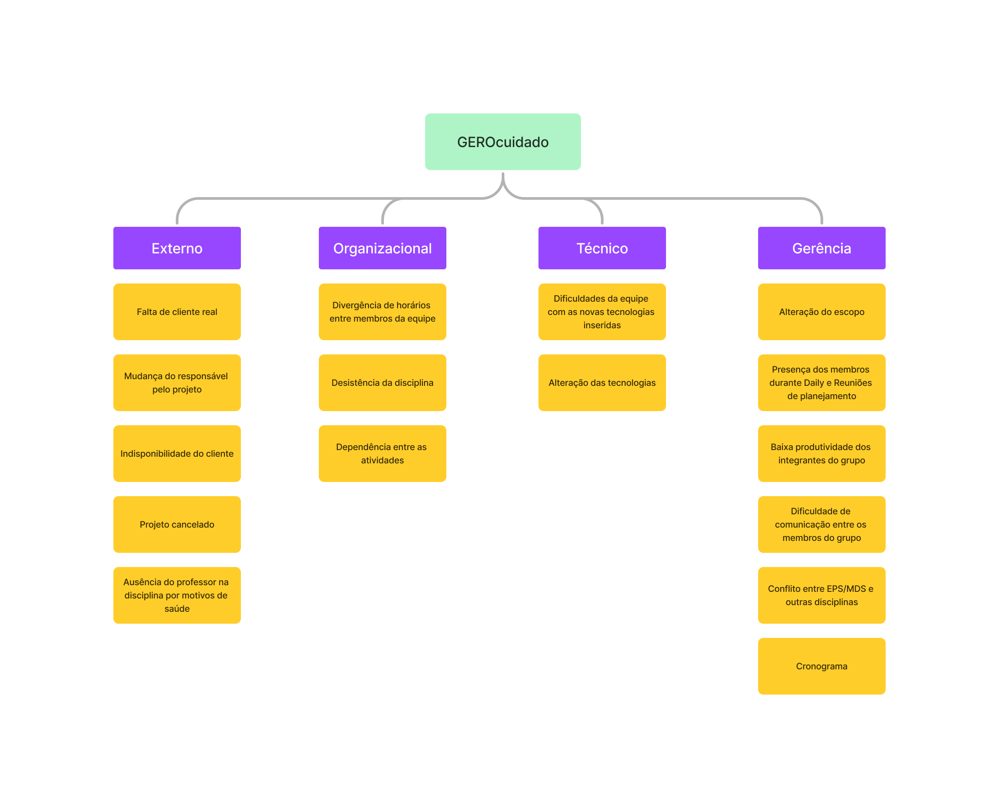

# Plano de Gerenciamento de Riscos

## Introdução

O Plano de Gerenciamento de Riscos tem por objetivo a identificação, análise e planejamento de medidas para os possíveis riscos que o projeto pode enfrentar. Depois do planejamento, torna-se possível fazer a gerência dos riscos, esta será feita pelo scrum master ao decorrer das sprints.

## Estrutura Analítica de Riscos (EAR)

Esta estrutura é responsável por agrupar as possíveis causas dos riscos, o que facilita os reconhecimentos e tratamentos de riscos do projeto, facilitando o processo de mitigação dos riscos. Tem como objetivo mostrar as principais categorias de risco para um tipo de projeto buscando especificidade, pois dessa forma o ganho de tempo na identificação é mais significativo. Os riscos podem ser classificados de acordo com as categorias:

* **Técnico**: São riscos associados à tecnologia, requisitos e qualidade.
* **Externo**: São os riscos relativos ao cliente, mercado ou ambiente.
* **Organizacional**: São relacionados à priorização e recursos do projeto.
* **Gerência**: São relativos à estimativa, planejamento, controle e comunicação.

## Diagrama

## Análise Quantitativa

### Probabilidade

| Probabilidade | Intervalo | Peso |
|:-------------:|:---------:|:----:|
| **Muito Baixa** | 0 a 10 | 1 |
| **Baixa** | 11 a 30 | 2 |
| **Média** | 31 a 50 | 3 |
| **Alta** | 51 a 65 | 4 |
| **Muito Alta** | 66 a 100 | 5 |

### Impacto

| Impacto | Descrição | Peso |
|:-------:|:---------:|:----:|
| **Muito Baixo** | Impacto pouco expressivo no desenvolvimento do projeto | 1 |
| **Baixo** | Pouco impacto no desenvolvimento do projeto | 2 |
| **Médio** | Possui certo impacto porém é facilmente recuperado | 3 |
| **Alto** | Há grande impacto no desenvolvimento do projeto | 4 |
| **Muito Alto** | O impacto inviabiliza o projeto | 5 |

### Prioridade

Se baseando com os valores do impacto e de probabilidade calcula-se a prioridade dos riscos. O que determina a urgência com que medidas devem ser tomadas para mitigar ou resolver um risco que pode impedir o projeto.

| Probabilidade/Impacto | Muito Baixa | Baixo | Média | Alta | Muito Alta |
|:---------------------:|:-----------:|:-----:|:-----:|:---:|:---------:|
| **Muito Baixa** | 1 | 2 | 3 | 4 | 5 |
| **Baixa** | 2 | 4 | 6 | 8 | 10 |
| **Média** | 3 | 6 | 9 | 12 | 15 |
| **Alta** | 4 | 8 | 12 | 16 | 20 |
| **Muito Alta** | 5 | 10 | 15 | 20 | 25 |

#### Valor de Prioridade

| Prioridade | Intervalo |
|:----------:|:---------:|
| Muito Baixo | 1 a 5 |
| Baixo | 6 a 10 |
| Médio | 11 a 15 |
| Alto | 16 a 20 |
| Muito Alto | 21 a 25 |

## Identificação dos Riscos

O processo de identificação de riscos se utilizou de identificação de riscos através da comparação análoga - método que se utiliza de experiências anteriores e similares para facilitar a concepção e identificação comum em projetos do gênero.

## Riscos Levantados

|Risco| Descrição | Ação Preventiva | Ação Reativa | Categoria | Probabilidade | Impacto | Prioridade |
|:---:|:---------:|:--------------:|:-----------:|:---------:|:-------------:|:-------:|:----------:|
| **R01** | Dificuldades da equipe com as novas tecnologias inseridas | Seleção de alunos experientes para aplicação de treinamento. | Realização de treinamento sobre tecnologias. | Técnico | 4 | 5 | 20 |
| **R02** | Divergência de horários entre membros da equipe | Elaboração de quadro de horários disponíveis da cada membro da equipe. | Planejamento de pareamento por sprint baseado na disponibilidade dos integrantes por meio do quadro de disponibilidade. | Organizacional | 4 | 3 | 12 |
| **R03** | Desistência da disciplina. | Estimular a máxima participação dos membros da equipe | Redistribuir tarefas de forma que não ocorra sobrecarga para nenhum dos membros do grupo e que o grupo consiga interagir da melhor maneira possível. | Organizacional | 2 | 5 | 10 |
| **R04** | Alteração do escopo | Documentar e refinar de forma constante os requisitos | Planejar corretamente a sprint e se manter atualizado quanto às novas funcionalidades que serão adicionadas ao projeto | Gerência | 5 | 4 | 20 |
| **R05** | Alteração das tecnologias | Definir de forma concisa o escopo do projeto | Planejar corretamente a sprint e se manter atualizado quanto às novas funcionalidades que serão adicionadas ao projeto | Técnico | 4 | 5 | 20 |
| **R06** | Presença dos membros durante Daily e Reuniões de planejamento | Definir datas, horários e locais que sejam acessíveis a todos. | Manter o time sempre alinhado quanto às decisões tomadas. | Gerência | 4 | 3 | 12 |
| **R07** | Falta de cliente real | Utilização de ferramentas que ajudem a levantar requisitos | Utilização de dados levantados por usuários que sejam o público alvo do projeto. | Externo | 5 | 2 | 10 |
| **R08** | Dependência entre as atividades | Priorização das atividades | Planejar Sprints de forma a evitar o excesso de dependências entre as issues | Organizacional | 3 | 3 | 9 |
| **R09** | Baixa produtividade dos integrantes do grupo | Motivação da equipe quanto à criação do projeto através de reuniões constantes | Aplicação de atividades de Gamificação e lúdicas do projeto para reintegração de membros desmotivados | Gerência | 3 | 5 | 15 |
| **R10** | Dificuldade de comunicação entre os membros do grupo | Elaborar e seguir plano de comunicações | Reuniões presenciais com a equipe para tomada de decisões | Gerência | 3 | 4 | 12 |
| **R11** | Conflito entre EPS/MDS e outras disciplinas | Realizar a validação de disponibilidade entre os membros de EPS e MDS | Menor atribuição de tarefas para membros com disciplinas conflitantes | Gerência | 5 | 4 | 20 |
| **R12** | Mudança do responsável pelo projeto | Perguntar ao PO se haverá alguma mudança na pessoa/equipe responsável | Realizar uma visão geral do projeto, abarcando as decisões tomadas anteriormente e o que está sendo feito no momento | Externo | 2 | 4 | 8 |
|**R13**| Enfrentar desafios ao avançar com a elaboração dos documentos do projeto e a possibilidade de retrabalho em documentos criados sem validação. | Visualizar um dia e um horário na semana que o cliente tem disponibilidade fora dos horários das reuniões e realizar as documentações/atividades antes dela | Preparar uma pauta de reunião para mostrar as atividades com prioridade mais alta e propor realizar uma validação assíncrona com as atividades que faltaram |Externo | 5 | 4 | 20 |
|**R14**| Projeto cancelado | Sempre buscar saber sobre o caminho que a disciplina irá tomar através das informações do professor e das aulas presenciais | Manter o planejamento do projeto | Externo | 1 | 5 | 5 |
|**R15**| Ausência do professor na disciplina por motivos de saúde | Obter informações inicialmente com o professor e posteriormente com o coordenador do curso | Manter o planejamento iniciado e buscar tirar dúvidas com os monitores | Externo | 3 | 4 | 12 |
|**R16**| Cronograma | Realizar uma estimativa colaborativa com toda a equipe para determinar o tempo e esforço necessários para concluir cada atividade e realizar a alocação correta de membros para cada atividade | Redistribuir as tarefas e alocações dos membros com o foco em concluir as tarefas cujo prazo está mais próximo | 
|**R17**| Escassez de Prazo | Criar e seguir o cronograma | Priorizar e concluir as tarefas | Organizacional | 5 | 4 | 20 | 

## Bibliografia

* RODRIGUES, Eli. EAR para projetos de software. [Link](https://www.elirodrigues.com/2013/09/21/gerenciamento-de-riscos-ear-para-projetos-de-software/). Acesso em 30 set 2019.

* SIQUEIRA, Lucas; OLIVEIRA, Caio. Plano de Gerenciamento de Riscos do grupo +Monitoria. Disponível em: [Link](https://fga-eps-mds.github.io/2019.1-MaisMonitoria/docs/plano-riscos). Acesso em 30 set 2019.

* JOÃO, Lucas. Plano de Gerenciamento de Riscos do grupo ArBC. Disponível em: [Link](https://github.com/fga-eps-mds/2019.2-ArBC/blob/develop/docs/Plano-Gerenciamento-Riscos.md). Acesso em 09 jul 2022.

## Histórico de Revisão

| Versão | Data       | Descrição                 | Autores    |
| ------ | ---------- | ------------------------- | ---------- |
| 1.0    | 07/09/2023 | Abertura do documento     | Pedro Cella |
