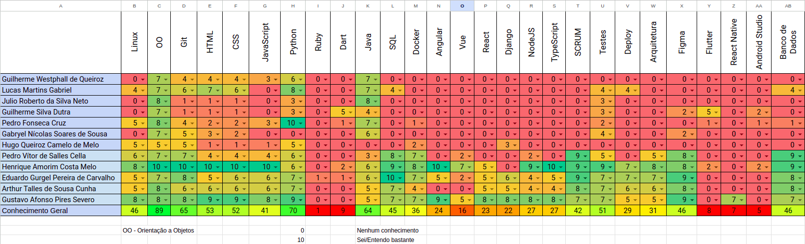

# Quadro de conhecimento

O quadro de conhecimento tem o objetivo de acompanhar o desenvolvimento dos integrantes, tanto de MDS quanto de EPS em relação as tecnologias utilizadas no projeto, esse quadro inicia sua implementação da Semana 2 com o intuito de vericar quais tecnologias os membros já tem um conhecimento sobre, e futuramente será atualizado em todas as Sprints. 

O quadro sofrerá alteração quando começar as Sprints, visto que o objetivo será o de medir o conhecimento em relação às tecnologias que são de fato usadas no projeto, em contradição ao quadro disponibilizado na Semana 2, cujo objetivo era o de saber quanto e quais tecnologias era sabida por cada integrante.

## Quadro de Conhecimento da Semana 2 (16/09):

<iframe width="2000" height="500" frameborder="0" scrolling="yes" src="https://docs.google.com/spreadsheets/d/e/2PACX-1vQBIt3ITuOTg6yWgtaCHSE02-C0hjBGbOp0iQBijc8RRikOwvrIwmQ9zm4P63kiJ60yrXa_oKJMLgSC/pubhtml?gid=0&single=true"></iframe>

