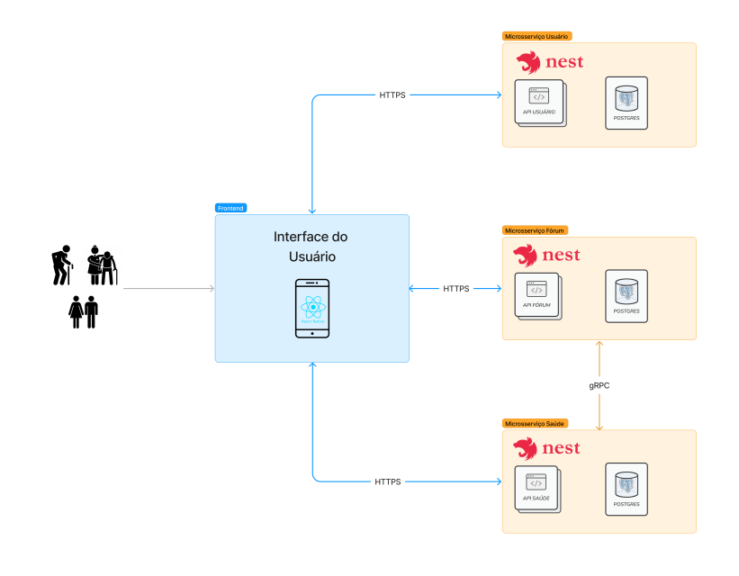

# Documento de Arquitetura

## Introdução

Esse documento tem a finalidade de explicar sobre as decisões arquiteturais do projeto, nesse documento o foco será entender mais sobre como funcionará o sistema como um todo, ou seja, como é feita a interação do usuário com o produto, quais são os microsserviços e de que forma eles foram definidos, entre outras possíveis dúvidas que possam surgir.

## Escopo

O GEROcuidado é um aplicativo projetado para auxiliar seus usuários, que incluem cuidadores formais e informais, idosos autônomos e familiares, na organização e acompanhamento da saúde dos idosos, seja como parte de suas responsabilidades de cuidador ou de sua própria família, como um pai ou uma mãe. No caso dos idosos autônomos, esse acompanhamento é realizado de si mesmo.

Nesse semestre a proposta do MVP focou nas funcionalidades de crud de usuário, crud de publicação, perfil de moderação nas publicações, crud de rotina, crud de idosos, cadastrar notificações, linkar notificações a uma agenda/calendário, crud das informações de saúde do idoso (métricas de saúde), como incremento teremos a interação com a publicação, através de likes e comentários, e foco na política de senhas e na capacidade de recuperar senha. Logo a arquitetura assim implementada, tem como intuito abarcar todas essas funcionalidades.

## Arquitetura

A arquitetura abaixo ilustra a forma como irá funcionar todas as partes, sendo elas o Frontend, onde ocorre o input através da interface de usuário, após esse input é encaminhado para o microsserviço especificado, sendo eles o Microsserviço Usuário atrelado as funcionalidades de CRUD quanto aos usuários e perfis de usuário, Microsserviço Fórum associado a parte do fórum, publicações, like e comentário e finalmente o  Microsserviço Saúde, responsável pelas informações de saúde do idoso, como pressão, oxigenação do sangue, entre outros. Além disso temos os bancos de cada microsserviços, responsável por armazenar todas essas informações. Abaixo a arquitetura ilustrando todos esses pedaços:

## Frontend

## Microsserviço Usuário

## Microsserviço Fórum 

## Microsserviço Saúde

## Documentos complementares

Como o foco desse documento é a arquitetura em si, foram criados outros dois documentos que tem como objetivo explicar mais profundamente sobre as ferramentas utilizadas e uma explicação no funcionamento do banco de dados, ambos os documentos podem ser acessados pelos seguintes links:

- [Documento de ferramentas](ferramentas.md)

- [Documento do banco de dados]()

## Histórico de versão

| Versão | Data       | Descrição | Autores |
| ------ | ---------- | --------- | ------- |
| 1.0    | 15/10/2023 | Abertura do documento | Pedro Cella|