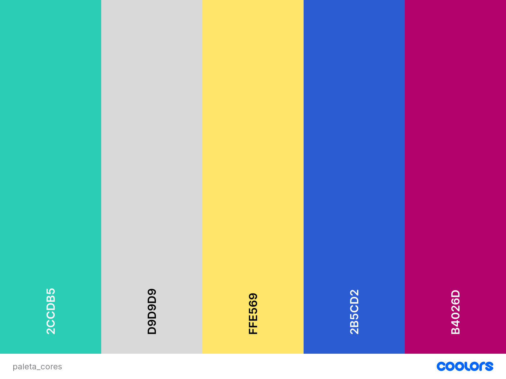

# Guia de Estilo

## 1. Introdução

Bem-vindo à Guia de Estilo da nossa aplicação! Este documento desempenha um papel vital na criação de uma experiência de usuário consistente. Aqui, você encontrará alguumas diretrizes de design que moldam a forma como nossa aplicação é apresentada ao mundo.

Imagine nossa Guia de Estilo como um mapa que orienta a jornada visual e interativa de nossa aplicação, por meio da definição de alguns dos elementos de design, como cores, tipografia e layout.

## 2. Nome da aplicação

O nome "Gero Cuidado" é muito mais do que um mero conjunto de palavras. Ele representa nosso firme compromisso em fornecer assistência e suporte de alta qualidade para os idosos, que merecem atenção e cuidados especiais. A palavra "Gero" é um prefixo derivado de "geriátrico", que está intrinsecamente ligado ao cuidado e à saúde das pessoas mais velhas. Reflete nossa dedicação em criar uma aplicação dedicada a melhorar a qualidade de vida e o bem-estar da população idosa.

## 3. Logo

# 4. Tipografia

As fontes utilizadas na aplicação serão:

- **Inter**

- **Roboto**

- **Work Sans**

# 5. Paleta de cores

## 6. Elementos de interação

### 6.1. Estilos de interação

* Navbar: será uma barra horizontal para a navegação do usuário no aplicativo. Cada item da navbar redirecionará a navegação para uma tela específica.

* Vertical Scroll Picker: componente de interface do usuário que permite aos usuários fazerem seleções através de uma rolagem vertical. Esse tipo de controle é frequentemente usado para escolher entre diferentes opções, valores ou itens em uma lista, percorrendo-os para cima ou para baixo.

* Botão: botões clicáveis com imagens que, ao ser clicado, leva o usuário até o conteúdo requerido

* Botões de alternância (toggle): elementos de interface que permitem aos usuários ativar ou desativar uma opção com um simples toque ou clique. 

* Checkbox: recurso comum às caixas de diálogos usado para ativar ou desativar mais de uma função em um programa. Visualmente é representado por um quadrado branco, que quando selecionado apresenta uma marcação em seu interior.

* Carousel: um slideshow para fazer um giro em vários coteúdos, construído com CSS 3D transforms e um pouco de JavaScript. Ele funciona com o uso de imagens, texto ou marcação personalizada. Também possui suporte para controles anterior, próximo e indicadores.

* Campo de pesquisa: campo utilizado pelo usuário para fazer pesquisa rápida de algum conteúdo, dentro do aplicativo.

* Cards: aqui serão os elementos que possuem geralmente uma imagem, pois podemos adicionar à essa imagem uma descrição. Ele pode ser tanto um link como um card explicativo, que poderá expandir para mostrar um conteúdo maior.

* Sliders: é um painel de conteúdos em que o seu conteúdo principal muda em um tempo determinado para dar lugar a outro conteúdo. Isso serve para mostrar conteúdos variados em um mesmo lugar para o usuário. O mesmo poderá navegar entre os conteúdos ou clicar para ser redirecionado à página deste conteúdo.

* Formulários: serão utilizados para login, para contato ou para qualquer outra atividade em que é necessário obter uma informação do usuário.

