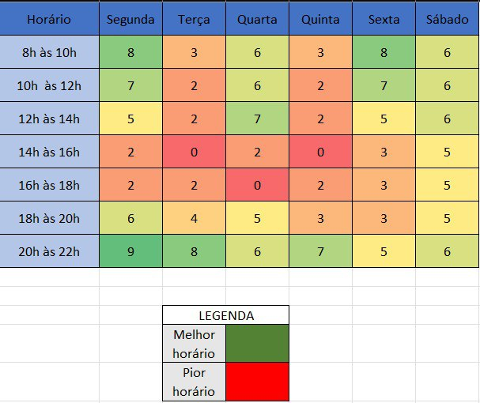
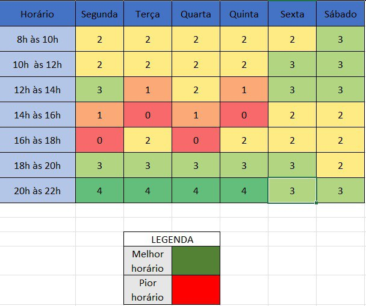
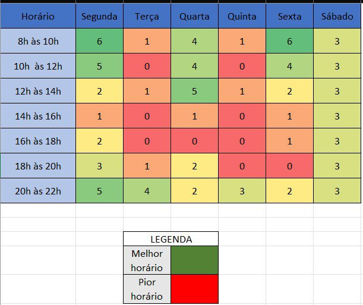

# Plano de comunicação
## Introdução

Durante a criação de um plano de comunicação muitos aspectos devem ser envolvidos. Entre as responsabilidades envolvidas temos: como as informações acerca do projeto devem ser transmitidas e por onde devem ser transmitidas. Além do melhor horario de disponibilidade, que deve ser monitorado para garantir que os serviços entreguem com alta qualidade.

Ao longo do semestre, o grupo terá inúmeras reuniões para desenvolver o projeto. Sabendo disso, mapear os melhores horários para as reuniões é crucial. A seguir temos o quadro de disponibilidade que visa o levantamento dos melhores horários para o agendamento de reuniões, levando em consideração o maior número de pessoas livres no horário.

## Ferramentas

| Ferramenta | Descrição |
| ---------- | --------- |
| Discord    | Comunicação rápida com o cliente e reuniões do time |
| Telegram   | Comunicação rápida entre o time |
| Teams      | Reuniões com o cliente |
| GitHub     | Repositório central para documentos e código |
| ZenHub     | Documentar a baseline de requisitos, roadmap, servir como quadro Kanban para o time e atribuições de tarefas |

## Reuniões pré agendadas

- Reunião com o cliente: quarta-feira às 18h00

## Quadro de Disponibilidade

Para o desenvolvimento do Quadro de Disponibilidade, o grupo pegou as informações de disponibilidade de cada integrante e compilou os dados na agenda Geral, de EPS e a de MDS. Segue os resultados do Quadro de Disponibilidade.

### Quadro Geral

*Total: 12 Pessoas*
*EPS: 5 Pessoas*
*MDS: 7 Pessoas*

### Quadro de EPS

*EPS: 5 Pessoas*

### Quadro de MDS

*MDS: 7 Pessoas*

## Plano de Reuniões

### Reunião - EPS

A reunião com os integrantes de EPS tem por objetivo alinhar sobre alguns processos gerenciais da equipe, organizar o que será abordado na reunião geral, iniciar o planejamento da reunião com o PO e separar as novas tarefas do backlog do produto. Essa reunião é realizada às 20:40 nas terças-feiras.

### Reunião Geral

A reunião geral é realizada com os integrantes de EPS e MDS, toda terça-feira às 21h, seguindo a seguinte estrutura:

1. Review
2. Planning
3. Validação das pautas e dúvidas para reunião com PO

Durante a planning ocorre o plano de ação para as tarefas que foram transbordadas(notada durante a review), apresentação das novas tasks, divisão das atividades e a realização do planning poker para gerar estimativas.

### Reunião com o PO

A reunião ocorre semanalmente às quartas-feiras com início às 12h e duração média de 1 hora sem intervalos. Participam da reunião: toda a equipe de desenvolvimento, o PO - Prof. Mário Andrade e os membros do Enactus - e o Prof. Hilmer.

A reunião tem como pontapé inicial as pautas feitas pelo PO, mais para frente a definição das pautas será gerido pelos membros de EPS que deverão encaminhar a pauta da reunião indicando os assuntos e o membro ou membros responsáveis pela apresentação da pauta.

### ATAs de reunião

As ATAs de reunião são geradas como insumo do que foi tratado na reunião e pontuar também quais membros estavam presentes além da duração;

A ata de reunião aborda 3 tópicos elementares:

1. Pautas da reunião
2. Membros participantes
3. Duração

**OBS:** É importante ressaltar que as ATAs devem apresentar também todas as dúvidas abordadas durante a reunião, sendo essas dúvidas podendo serem adicionadas como subtópico da pauta.

## Histórico de versões

| Versão | Data       | Descrição | Autores |
| ------ | ---------- | --------- | ------- |
| 1.0    | 06/09/2023 | Abertura do documento | Pedro Cella |