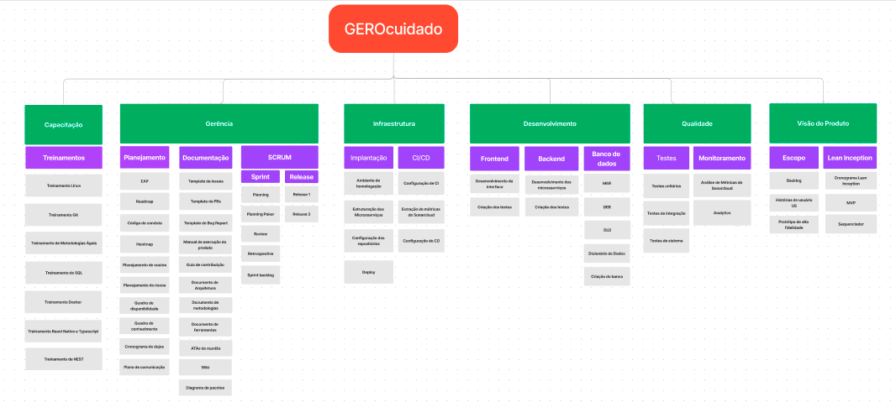
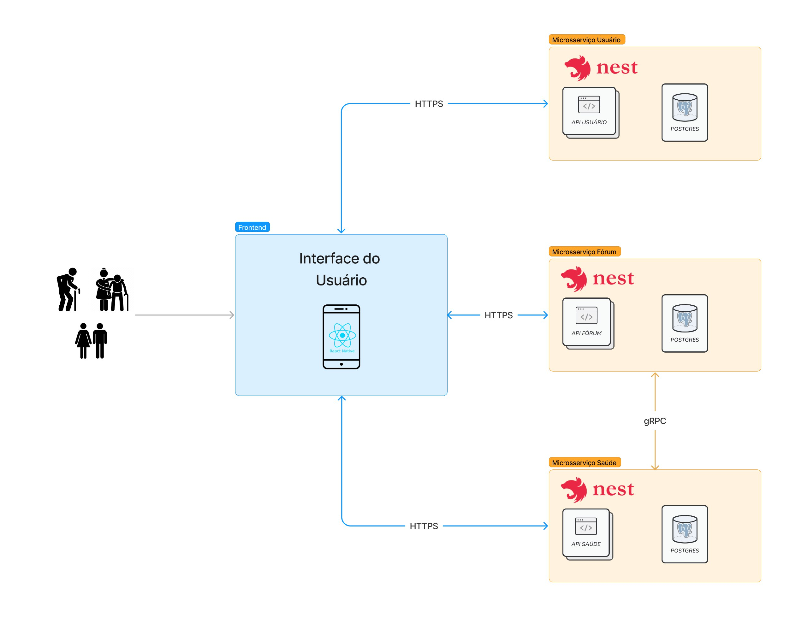

## ATA de Reunião (05/10):

## Pauta

- Criação e definição da arquitetura;
- Criação do EAP;

## Documentos produzidos

### EAP

### Diagrama de Arquitetura

| <b>Presentes na Reunião (05/10)</b> | <b>Equipe Pertencente</b> | <b>Info</b> |
| ----------------------------------- | ------------------------- | ----------- |
| Arthur Talles de Sousa Cunha        | EPS                       | Presente    |
| Eduardo Gurgel Pereira de Carvalho  | EPS                       | Presente    |
| Gustavo Afonso Pires Severo         | EPS                       | Presente    |
| Henrique Amorim Costa Melo          | EPS                       | Presente    |
| Pedro Vítor de Salles Cella         | EPS                       | Presente    |
| Duração                             | 02:39:00                  |             |
