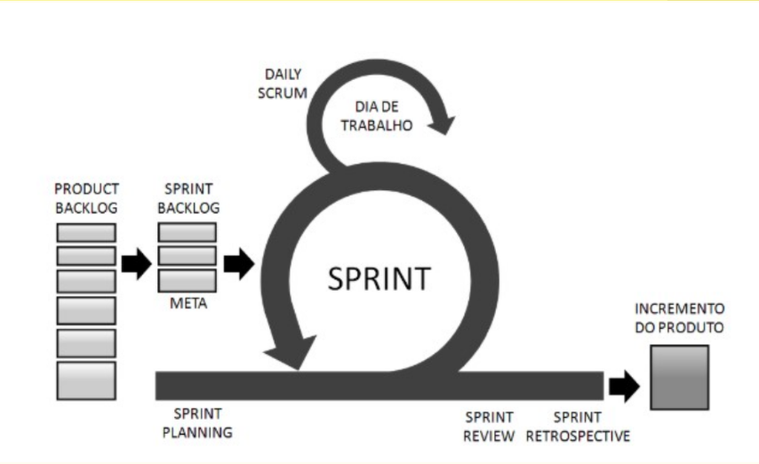
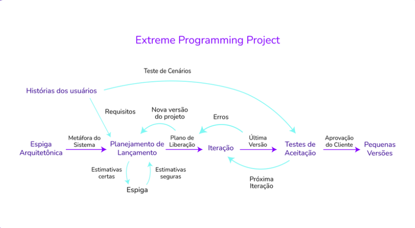
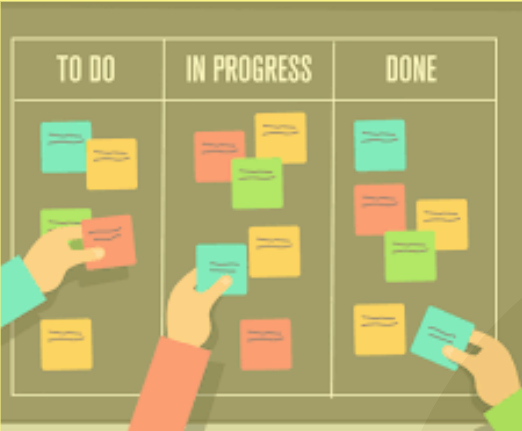

## Guia de Metodologias Ágeis para iniciantes

### Slides usados na apresentação

<iframe src="https://docs.google.com/presentation/d/1ZO-yXJLFPxDbasVOVvcBYjwNTqeZNSoc/embed?usp=sharing&ouid=112041008512135424809&rtpof=true&sd=true" frameborder="0" width="960" height="569" allowfullscreen="true" mozallowfullscreen="true" webkitallowfullscreen="true"></iframe>

### Metodologias ágeis

A metodologia ágil é um conjunto de práticas que visam permitir, por meio de inspeção e adaptações frequentes, entregas rápidas, com qualidade e alinhadas à necessidade do cliente e da empresa.

Em 2001 surgiu o Manifesto Ágil de Desenvolvimento de Software, documento tão importante que funcionou como uma bíblia para o desenvolvimento ágil até hoje, expondo todos os princípios e boas práticas que precisam ser aplicadas.

Ele surgiu durante uma reunião de desenvolvedores de software ocorrida nas montanhas de Utah, nos Estados Unidos. A comunidade de desenvolvedores estava cansada de usar métodos considerados “pesados” e por isso decidiu lançar um manifesto detalhado.

As metodologias ágeis defendem que, acima de tudo, devemos buscar a satisfação do cliente por meio de entregas contínuas que agregam valor, mantendo uma comunicação constante entre os membros da equipe. É uma interação dinâmica que permite trabalhar com divisões claras de etapas. Isso vem ajudando muitas equipes a enfrentarem incertezas e imprevisibilidades por meio de entregas incrementais e iterativas.

A metodologia ágil possui 4 valores básicos, que são difundidos e respeitados pelos times:

- Software em funcionamento mais que documentação abrangente;
- Indivíduos e interação mais que processos e ferramentas;
- Colaboração com o cliente mais que negociação de contratos;
- Responder a mudanças mais que seguir um plano.

### Frameworks ágeis

#### SCRUM

Scrum é um conjunto de boas práticas empregado no gerenciamento de projetos complexos, em que não se conhece todas as etapas ou necessidades.

Focado nos membros da equipe, o Scrum torna os processos mais simples e claros, pois mantém registros visíveis sobre o andamento de todas as etapas.

Assim, os participantes sabem em que fase o projeto está, o que já foi concluído e o que falta ser feito para a sua entrega.

A metodologia também possibilita que produtos sejam apresentados em menor tempo, sem deixar de lado a qualidade.

Ela é aplicada a partir de ciclos rápidos, chamados sprints, nos quais há um tempo determinado para que as atividades sejam concluídas – geralmente, entre duas e quatro semanas.

Priorizando a criatividade e fluidez nos processos, o Scrum segue seis princípios:

- Flexibilidade dos resultados
- Flexibilidade dos prazos
- Times pequenos
- Revisões constantes
- Colaboração
- Orientação a objetos.

#### EXtreme Programming (XP)

O XP (Extreme Programming ou Programação Extrema) é uma metodologia focada no desenvolvimento de software que possui valores e princípios, onde são fundamentados por um conjunto de práticas.

É uma metodologia leve que pode facilmente ser adotada por diferentes níveis de desenvolvedores (experientes ou não) e em qualquer tamanho de equipe. É uma excelente metodologia por se adaptar a requisitos que às vezes podem mudar rapidamente.

O XP pode ser utilizado de forma complementar ao Scrum, pois ele acaba focando mais em processos de engenharia e desenvolvimento de software.

#### Kanban

Kanban é um sistema visual de gestão de trabalho, que busca conduzir cada tarefa por um fluxo predefinido de trabalho.

Em geral, o conceito de Kanban pode ser definido pelos seguintes itens:

- O sistema visual: um processo, definido em um quadro com colunas de separação, que permite dividir o trabalho em segmentos ou pelo seu status, fixando cada item em um cartão e colocando em uma coluna apropriada para indicar onde ele está em todo o fluxo de trabalho. 
- Os cartões: que descrevem o trabalho real que transita por este processo.
- A limitação do trabalho em andamento: que permite atribuir os limites de quantos itens podem estar em andamento em cada segmento ou estado do fluxo de trabalho.

Ou seja, o Kanban é um fluxo de trabalho que busca indicar (e limitar) o trabalho em andamento ou WIP, Work In Progress.

### Referências

[1] O que é SCRUM. Acessado em Set.2023. Disponível em: https://fia.com.br/blog/scrum/

[2] O que é XP. Acessado em Set.2023. Disponível em: https://www.treinaweb.com.br/blog/o-que-e-xp-extreme-programming

[3] O que é Kanban. Acessado em Set.2023. Disponível em: https://www.totvs.com/blog/negocios/kanban/#:~:text=O%20termo%20